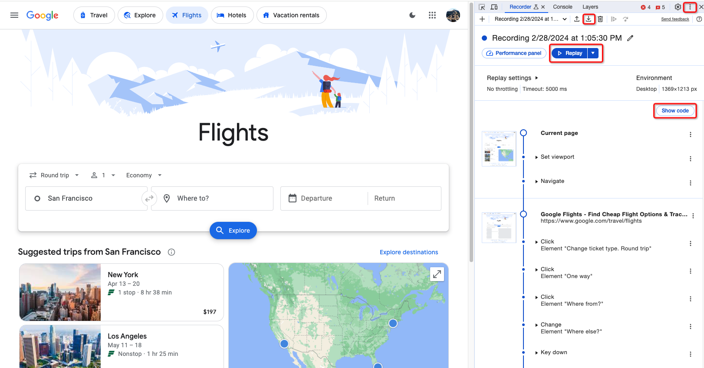
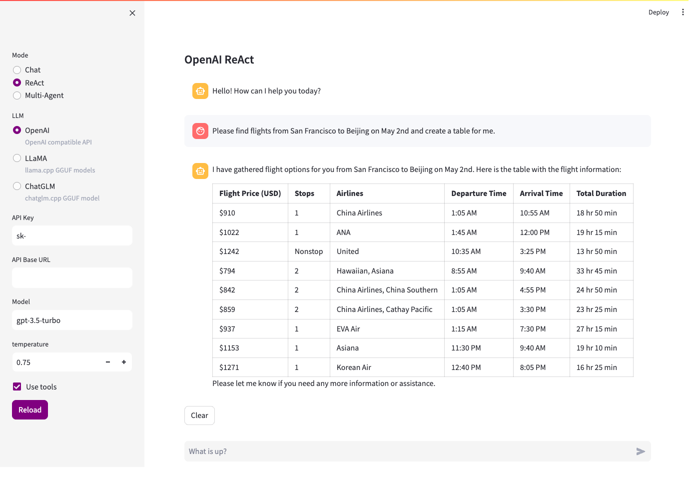

# Browser recording to AI replay

## More playbooks for AI

LLM possesses a robust natural language understanding capability, allowing AI systems built with LLM to grasp human intent effectively. This revolutionizes the way individuals interact with software, as they can now give commands using natural language for software to perform specific tasks. By harnessing LLM's reasoning capacity, more intelligent Agent systems can be created. These Agents not only understand human intent to carry out direct commands but also analyze, break down, and plan task execution for more intricate tasks. This enables humans to delegate higher-level tasks instead of being restricted to specific instructions.

There is a growing demand for web automation, typically achieved through RPA. The potential for AI to handle web automation tasks is promising, allowing for more intuitive and efficient execution of tasks. The capabilities of AI in web automation rely on the functions provided by programmers, highlighting the importance of a well-rounded set of functions for optimal performance.

Chrome browser has a built-in feature that allows users to record their actions on a webpage and then replay them at a later time. This feature is called "Record and Replay" and it is designed to help developers and testers easily create and replay test scripts.

Enabling AI to replay the results of Browser recording as needed would greatly enhance AI's capabilities for web automation.

`iauto` is an automation toolset designed for AI, featuring workflow orchestration, automation, and AI Agent capabilities. It allows users to orchestrate task flows through low-code playbooks, which can be utilized as tools by the AI system on demand.

I will show you how to use browser recording to create playbooks for AI, step by step.

## Browser recording

We will create a function for Google flight search that can be utilized by AI.

1. Open your Chrome web browser, go to https://www.google.com/travel/flights, and press F12 to access DevTools.
2. Select `Recorder` tool.
3. Click `Create a new recording` .
4. Click `Start recording` to begin recording.
5. In the browser, choose one-way, enter the departure and arrival locations and date, then click search.
6. Click `End recording` to end recording.
7. Click on `Replay` to check if the recorded process functions correctly.
   8 Click `Export` or `Show code` to export the recorded operations as a JSON file.



Now that I have obtained a JSON file recording the operation process, I will save it as `google_flights_search_replay_script.json`.

We will replace some input data recorded during the recording process with variables so that AI can substitute these values.

```json
{
  "title": "Recording 2/28/2024 at 1:05:30 PM",
  "steps": [
    {
      "type": "setViewport",
      "width": 1369,
      "height": 1213,
      "deviceScaleFactor": 1,
      "isMobile": false,
      "hasTouch": false,
      "isLandscape": false
    },
    {
      "type": "navigate",
      "url": "https://www.google.com/travel/flights",
      "assertedEvents": [
        {
          "type": "navigation",
          "url": "https://www.google.com/travel/flights",
          "title": "Google Flights - Find Cheap Flight Options & Track Prices"
        }
      ]
    },
    {
      "type": "click",
      "target": "main",
      "selectors": [
        ["aria/Change ticket type. ​Round trip"],
        ["div.RLVa8 div.VfPpkd-TkwUic"],
        [
          "xpath///*[@id=\"yDmH0d\"]/c-wiz[2]/div/div[2]/c-wiz/div[1]/c-wiz/div[2]/div[1]/div[1]/div[1]/div/div[1]/div[1]/div/div/div/div[1]"
        ],
        ["pierce/div.RLVa8 div.VfPpkd-TkwUic"]
      ],
      "offsetY": 21,
      "offsetX": 56.5
    },
    {
      "type": "click",
      "target": "main",
      "selectors": [
        ["aria/One way"],
        ["div.RLVa8 li:nth-of-type(2)"],
        [
          "xpath///*[@id=\"yDmH0d\"]/c-wiz[2]/div/div[2]/c-wiz/div[1]/c-wiz/div[2]/div[1]/div[1]/div[1]/div/div[1]/div[1]/div/div/div/div[2]/ul/li[2]"
        ],
        ["pierce/div.RLVa8 li:nth-of-type(2)"]
      ],
      "offsetY": 40,
      "offsetX": 75.5
    },
    {
      "type": "click",
      "target": "main",
      "selectors": [
        ["aria/Where from?"],
        ["div.BGeFcf div.cQnuXe input"],
        ["xpath///*[@id=\"i21\"]/div[1]/div/div/div[1]/div/div/input"],
        ["pierce/div.BGeFcf div.cQnuXe input"]
      ],
      "offsetY": 20,
      "offsetX": 70.5
    },
    {
      "type": "change",
      "value": "{$from}",
      "selectors": [
        ["aria/Where else?"],
        ["#i21 > div.ZGEB9c input"],
        ["xpath///*[@id=\"i21\"]/div[6]/div[2]/div[2]/div[1]/div/input"],
        ["pierce/#i21 > div.ZGEB9c input"]
      ],
      "target": "main"
    },
    {
      "type": "keyDown",
      "target": "main",
      "key": "Enter"
    },
    {
      "type": "keyUp",
      "key": "Enter",
      "target": "main"
    },
    {
      "type": "keyDown",
      "target": "main",
      "key": "Tab"
    },
    {
      "type": "keyUp",
      "key": "Tab",
      "target": "main"
    },
    {
      "type": "change",
      "value": "{$to}",
      "selectors": [
        ["aria/Where to? "],
        ["div.vxNK6d div.cQnuXe input"],
        ["xpath///*[@id=\"i21\"]/div[4]/div/div/div[1]/div/div/input"],
        ["pierce/div.vxNK6d div.cQnuXe input"]
      ],
      "target": "main"
    },
    {
      "type": "keyDown",
      "target": "main",
      "key": "Enter"
    },
    {
      "type": "keyUp",
      "key": "Enter",
      "target": "main"
    },
    {
      "type": "keyDown",
      "target": "main",
      "key": "Tab"
    },
    {
      "type": "keyUp",
      "key": "Tab",
      "target": "main"
    },
    {
      "type": "change",
      "target": "main",
      "selectors": [
        "div.ZGEB9c div.kStSsc input",
        "xpath///*[@id=\"ow83\"]/div[2]/div/div[2]/div[1]/div[1]/div[1]/div/input",
        "pierce/div.ZGEB9c div.kStSsc input"
      ],
      "value": "{$date}"
    },
    {
      "type": "keyDown",
      "target": "main",
      "key": "Enter"
    },
    {
      "type": "keyUp",
      "key": "Enter",
      "target": "main"
    },
    {
      "type": "waitForElement",
      "selectors": ["pierce/div.akjk5c span"]
    },
    {
      "type": "click",
      "timeout": 10000,
      "target": "main",
      "selectors": [
        "div.akjk5c span",
        "xpath///*[@id=\"ow83\"]/div[2]/div/div[3]/div[3]/div/button/span",
        "pierce/div.akjk5c span"
      ],
      "offsetX": 9.484375,
      "offsetY": 8,
      "duration": 3000
    },
    {
      "type": "click",
      "target": "main",
      "selectors": [
        "div.MXvFbd span.VfPpkd-vQzf8d",
        "xpath///*[@id=\"yDmH0d\"]/c-wiz[2]/div/div[2]/c-wiz/div[1]/c-wiz/div[2]/div[1]/div[1]/div[2]/div/button/span[2]",
        "pierce/div.MXvFbd span.VfPpkd-vQzf8d",
        "text/Search"
      ],
      "offsetX": 21.453125,
      "offsetY": 11,
      "duration": 1000
    }
  ]
}
```

## Prepare playbook for AI

Next, we will create a playbook that allows AI to be called as a function.

The spec section is used to define the name, description, and arguments details of the function.

The `browser.replay` is used to replay the process we just recorded.

Use `browser.content` to retrieve search results.

`google_flights_search.yaml`:

```yaml
playbook:
  spec:
    name: google_flights_search
    description: Google flights search.
    arguments:
      - name: from
        type: string
        description: Departure
        required: true
      - name: to
        type: string
        description: Destination
        required: true
      - name: date
        type: string
        description: "Departure, format like: Apr 1"
        required: true
  actions:
    - browser.open:
        args:
          exec: /Applications/Google Chrome.app/Contents/MacOS/Google Chrome
          headless: false
          slow_mo: 1000
        result: $browser
    - browser.replay:
        args:
          browser: $browser
          script: ./google_flights_search_replay_script.json
    - time.wait: 3
    - browser.content:
        args:
          browser: $browser
          selector: ".pIav2d .JMc5Xc"
        result: $text
    - browser.close: $browser
    - echo: $text
```

You can now hand over this playbook to AI, which will automatically execute it when needed.

We reused the content from the playbooks directory here.

`llm_chat.yaml`:

```yaml
playbook:
  actions:
    - llm.session:
        args:
          provider: $llm_provider
          llm_args: $llm_args
          tools:
            - shell.cmd
        actions:
          - playbook:
              args:
                - ./google_flights_search.yaml
                - ./bing.yaml
                - ./fetch_links_from_url.yaml
                - ./get_readability_text_from_url.yaml
        result: $session
```

## Play with AI

Let's now launch the playground to test it out. We have selected the ReAct mode, allowing AI to make decisions independently.

We've requested AI to search for flights from San Francisco to Beijing on May 2nd.

It works perfectly!



By leveraging browser recording and iauto's replay capabilities, we can easily integrate web automation with LLM and Agent, enabling us to instruct AI to perform more complex tasks through conversations. This approach enhances work efficiency and automation levels.
